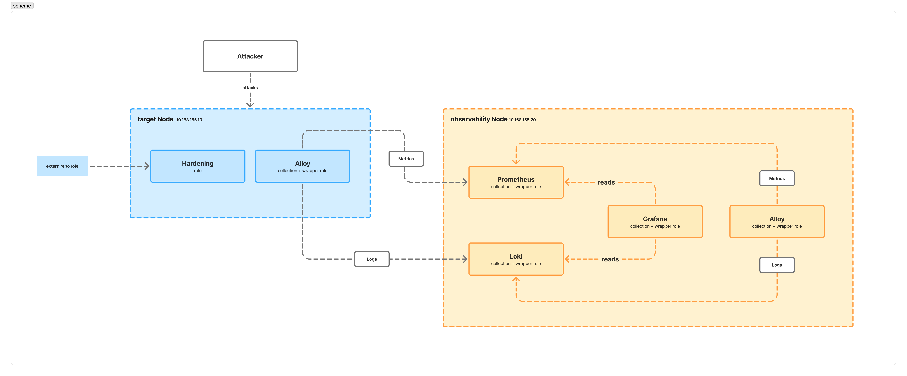

# ansible-detection-lab

Ein reproduzierbares Detection-Lab, durchgängig mit Ansible provisioniert:

- **target**: ein gehärteter Linux-Host (SSH, nftables, PAM, sysctl, auditd, fail2ban)
- **observability**: Prometheus, Loki und Grafana
- **Grafana Alloy** auf beiden Hosts, schickt Logs an Loki und Metriken an Prometheus

Angriffe werden gegen den Target-Host simuliert und über die Pipeline erkannt.
Die Hardening-Rolle liegt in einem eigenen Repo ([ansible-role-linux-hardening](https://github.com/0xseb000/ansible-role-linux-hardening)) und wird hier als gepinnte Abhängigkeit eingebunden.

## Architektur



Logs und Metriken sind zwei unabhängige Signale: Logs zeigen, was passiert ist,
Metriken zeigen, was aufgehört hat (ein gestoppter Agent hinterlässt kein Log,
nur eine Lücke).

## Komponenten

- **Prometheus**: Zeitreihen-Datenbank für Metriken -> speichert numerische
  Messwerte über die Zeit (CPU, RAM, Erreichbarkeit) und fragt sie per PromQL ab.
- **Loki**: Log-Datenbank -> speichert und durchsucht Logzeilen, indexiert nach
  wenigen Labels statt per Volltext, abgefragt per LogQL.
- **Grafana**: Visualisierungs- und Alerting-Oberfläche -> fragt Prometheus und
  Loki ab und stellt beides in Dashboards dar.
- **Grafana Alloy**: Telemetrie-Agent auf jedem Host -> sammelt Logs und
  Metriken lokal und schickt sie an Loki bzw. Prometheus.

## Design: Wrapper-Rollen

Prometheus, Loki, Grafana und Alloy zu installieren ist gelöste Arbeit und wird
von den Upstream-Collections `prometheus.prometheus` und `grafana.grafana`
übernommen. Der Eigenanteil dieses Repos liegt dort, wo der Security-Wert ist:
Detection-Rules, Log-Pipelines, Dashboards und Angriffsszenarien.

Jede Rolle unter `roles/` ist ein dünner Wrapper mit dem Namen `w_<component>`:

| Pfad | Zweck |
|------|-------|
| `tasks/main.yml` | `include_role` auf die Upstream-Rolle -> die explizite Schnittstelle |
| `defaults/main.yml` | eigener Inhalt, aus `group_vars`/`host_vars` überschreibbar |
| `vars/main.yml` | bewusst feste Werte (gepinnte Versionen) |

`w_*`-Variablen sind die eigenen, die unpräfixierten (`prometheus_*`, `grafana_*`, …)
gehören den Collections. `include_role` wird statt `meta/dependencies` verwendet,
damit jede Upstream-Rolle als benannter Task in der Ausgabe erscheint. So bleibt
die Trennung zwischen Fremd- und Eigenleistung sichtbar.

## Aufbau

```
inventory/          Hosts + group_vars (Datasource-UIDs, Secrets)
playbook/site.yml   Einstiegspunkt
roles/w_*           Wrapper-Rollen
roles/galaxy/       heruntergeladene Abhängigkeiten (gitignored)
scenarios/          Angriffsskripte
```

## Voraussetzungen (Control Node)

- Vagrant mit Parallels-Provider
- Ansible
- **GNU tar**: Die Exporter-Rollen entpacken die Release-Archive auf dem Control
  Node, und `unarchive` benötigt GNU tar. Unter macOS: `brew install gnu-tar`.

## Setup

```bash
cp inventory/group_vars/vault.yml.example inventory/group_vars/vault.yml
# grafana_admin_password setzen, dann:
ansible-vault encrypt inventory/group_vars/vault.yml

ansible-galaxy install -r requirements.yml
ansible-galaxy collection install -r requirements.yml
vagrant up
```

Grafana: `http://10.168.155.20:3000`. Datasources und das **Detection Lab**
Dashboard werden automatisch provisioniert und überstehen einen Neuaufbau.

## Verifizieren

```bash
vagrant destroy -f && vagrant up      # von null
vagrant provision                     # zweiter Lauf muss changed=0 melden
curl -s http://10.168.155.20:9090/-/healthy
curl -s http://10.168.155.20:3100/ready
```

## Angriffsszenarien

[`scenarios/README.md`](scenarios/README.md). Übersicht:

| # | Angriff | Signal | Quelle |
|---|---------|--------|--------|
| 01 | SSH-Bruteforce | fail2ban-Ban + Spike bei Fehlversuchen | Loki |
| 02 | sudo-Missbrauch | sudo-Befehl geloggt | Loki |
| 03 | Rogue-Account | useradd geloggt | Loki |
| —  | Agent gestoppt | `absent(up)`-Alert | Prometheus |

## Designentscheidungen

- **Push statt Pull**: Alloy pusht Metriken via `remote_write`; Prometheus läuft
  mit `--web.enable-remote-write-receiver`. Ein gestoppter Agent lässt die
  Zeitreihe verschwinden, weshalb der `absent(up)`-Alert existiert statt
  `up == 0`.
- **Labels mit geringer Kardinalität**: Die gebannte IP bleibt in der Logzeile
  und wird zur Query-Zeit extrahiert; als Label würde sie pro IP einen eigenen
  Loki-Stream erzeugen.
- **Feste Datasource-UIDs** (`loki`, `prometheus`) —> provisionierte Dashboards
  referenzieren sie; zufällige UIDs würden nach einem Neuaufbau jedes Panel brechen.
- **Gepinnte Versionen**: Komponenten-Versionen in jeder `vars/main.yml`,
  Collections und Hardening-Rolle in `requirements.yml`.

## Bekannte Einschränkungen

- Nur ein Target-Host; Szenarien 02–03 laufen auf dem Target (Post-Compromise).
- Bei parallelem `vagrant up` ist die private Netzwerkkarte teils noch nicht
  bereit, wenn Ansible zum ersten Mal verbindet -> `vagrant provision` erneut
  ausführen.

## Nächste Schritte

- Dedizierte Angreifer-VM (Kali) mit hydra/nmap statt einer SSH-Schleife
- `fail2ban_exporter` für aktuelle Ban-Metriken neben der Log-Historie
- auditd-Integritätserkennung (SUID-Änderungen, Zugriff auf sensible Dateien)
